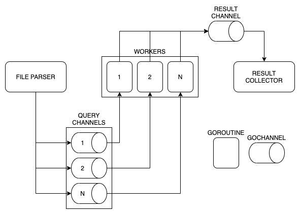

# benchy
### hamza ali taş

a command-line application for benchmarking  a specific TimescaleDB SQL query. 

## requirements and setup
requires a PostgreSQL instance to connect

- if you have docker installed
    - run `setup_db.sh`
    - creates `interview` network
    - creates timescaledb container named `interview-db` with user `postgres` and password `12345` and attached to `interview` network  
    - exposes `5432` port to host machine
    - creates the database and applies the schema
    - imports test data into the container database 
 
## build and run
golang:
- `go install` then run `benchy`
- `go build` then run `./benchy`
 
docker: 
- build: `docker build -t benchy .`
- run: `data/query_params.csv | docker run --rm [--network interview] -i benchy`
- or just run script `./run.sh`

## usage

**examples**

```shell script
# golang
benchy -config config.json -file data/query_params.csv
cat data/query_params.csv | benchy -config config.json -host some.ip.val.ue

# docker
cat data/query_params.csv | docker run --rm -i benchy
cat data/query_params.csv | docker run --rm -i benchy -port 1234 
```

possible configuration flags as follows;
```
-config string
    custom config path
-db string
    database schema name (default "postgres")
-file string
    csv file input path for query parameters
-host string
    database host (default "localhost")
-password string
    database password
-port int
    database port (default 5432)
-ssl
    database ssl mode
-user string
    database user (default "postgres")
-worker int
    worker count (default 5)
```

---

**notes**

- if the `-file` flag not provided, program reads `STDIN` as the csv file input
- if the `-file` flag provided, program reads the given file path and ignores `STDIN` input
- configuration can be passed by providing a `config.json` file as flag, however, flags will always override the configuration

---

example json configuration 
```json
{
  "worker_count": 5,
  "postgres": {
    "host":"interview-db",
    "port": 5432,
    "ssl": false,
    "db": "homework",
    "user": "postgres",
    "password": "12345"
  }
}
```

## implementation

project scaffold with `go mod init`, built using go standard libraries, and the only external dependency is the `pq` postgresql driver.

concurrency provided by using go routines communication with channels and synchronized using wait groups.

program splits into four main parts;
- read config
- start workers
- read csv line by line and parse assign jobs to workers
- collect results and print

data flow diagram;
